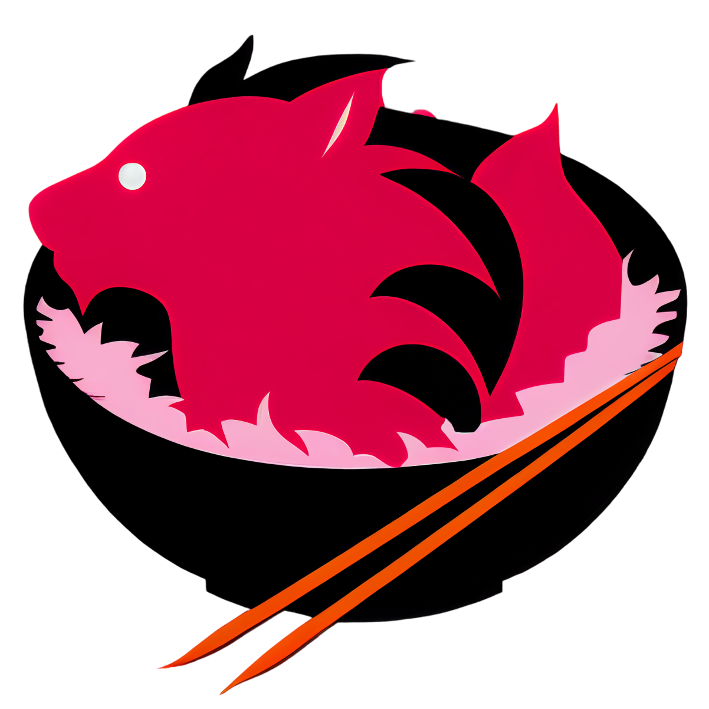

<div align="center">
  
  <h1>POKE</h1>
  <small>(has nothing to do with Pokémon)</small>
  <p>Rest API to manage Hawaiian Poke dishes restaurants</p>
</div>

## Project Setup

Setup the project

```bash
./setup.sh
```

When the containers are running, run the fixtures:

```bash
./seed.sh
```

## How to use

API Docs:

```txt
http://localhost:5000/api
```

Client application:

```txt
http://localhost:3000
```

### Fixtures

There are default fixtures data to test the application.

- To test with an admin account, you can either use `sami@poke.fr` or `thomas@poke.fr`
- To test with customers accounts, you can use `adel@poke.fr` or `jérémy@poke.fr`

_NOTE: for testing purposes, default users' password is the following
highly secure password:_ `password`

## Todo's

- ✅ Controllers
- ✅ Providers
- ✅ Modules
- ✅ Pipes
- ✅ Guards
- ✅ JWT Authentication
- ✅ Roles management
- ✅ Environment variables security
- ✅ Databases
- ✅ Data validation
- ✅ Routes versionning
- ❌ Database backup
- ✅ Logging
- ✅ Response compression
- ✅ Secure headers
- ✅ CORS
- ✅ Rate-limit
- ✅ Docker
- ❔ Comments
- ✅ No Any
- ✅ Documentation
- ✅ No sensitives variables
- ✅ Git
- ❌ Unit tests
- ✅ Front Application
- ❌ GraphQL
- ❌ Microservices
- ✅ Swagger
- ❌ NPM Package
- ✅ CI/CD
- ❌ Hosting

## Credits

- Adel Senhadji
- Thomas Geoffron
- Sami Zerrai
- Jérémy Jumpertz
